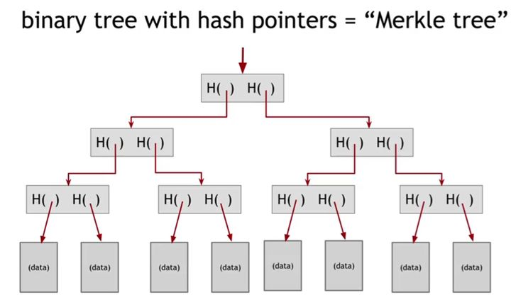
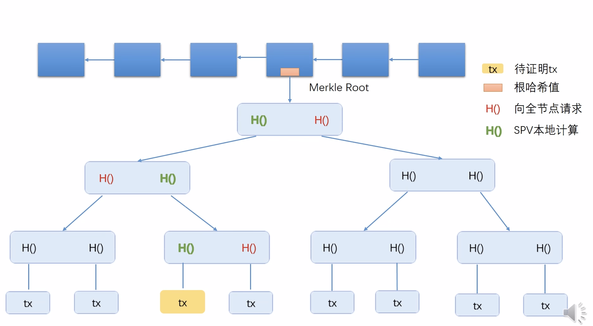

## Hash Pointers

Hash Pointers(哈希指针): 存储数据内存地址及数据的哈希值

Chain Block Link(区块链): 区块组成的链表

区块链表与普通链表区别:

* block chain is a linked list using hash pointers(用哈希指针代替了普通指针)

区块

* Genesis block 创世纪块

* Most resent block 最近生成块

每个区块包含指向前个区块的哈希指针

当前区块的哈希指针中的哈希值,为上个区块所有内容(包含哈希指针)的哈希值

Tampper-evident log 篡改证明记录

只需要保存最后一个哈希值,就可以检测出区块链中任意部分是否发生修改

## Merkle Tree

Merkle Tree(默克尔数):使用哈希指针构建的二叉树通常被称为默克尔树

Merkle Tree 分为 data blocks 和 hash pointers 两部分

* data blocks   叶子节点,存放数据

* hash pointers 由子节点的哈希指针组成哈希指针节点的数据部分

[奇数个数据节点的情况:最后一个节点复制一份作为兄弟节点]

在BTC中,每个data block都存放了一个Transaction(交易)

只要有根节点的哈希值,就能检测出树中任何部位的修改

Chain Block 由 block header 和 block body 组成

block header 块头 存放merkle tree的根哈希值

block body   块身 存放交易列表

merkle proof

从交易在merkle tree的位置,到根节点的路径叫做merkle proof

节点分为全节点和轻节点

* 全节点包含所有交易信息

* 轻节点只保存block header

如何向轻节点证明某个交易保存到了区块链 proof of membershi(proof of inclusion)存在证明

使用merkle proof, 全节点只需要把交易merkle proof上交易缺少的哈希值传给轻节点,轻节点只需要用交易算出哈希值与交易的哈希值进行拼接计算就可以算出根哈希值,最后对比根哈希值的值是否正确

proof of non-membership 不存在证明

出现的交易可能在叶节点的任何位置,只能通过线性遍历查找

sorted merkle tree 叶子节点哈希值排序后的merkle tree

