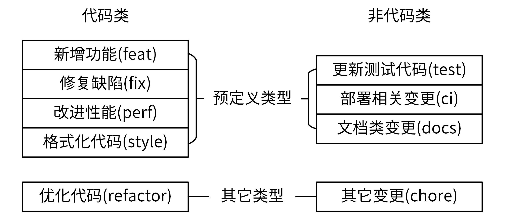

开发常用规范:

* 非编码类规范
  * 开源规范
  * 文档规范
  * 版本规范
  * 提交规范
  * 发布规范

* 编码类规范
  * 目录规范
  * 代码规范
  * 接口规范
  * 日志规范
  * 错误码规范


## 开源规范

一个开源项目一定需要一个开源协议，开源协议规定了你在使用开源软件时的权利和责任，也就是规定了你可以做什么，不可以做什么。所以，开源规范的第一条规范就是选择一个合适的开源协议。


1. 第一，开源项目，应该有一个高的单元覆盖率。这样，一方面可以确保第三方开发者在开发完代码之后，能够很方便地对整个项目做详细的单元测试，另一方面也能保证提交代码的质量。

2. 第二，要确保整个代码库和提交记录中，不能出现内部 IP、内部域名、密码、密钥这类信息。否则，就会造成敏感信息外漏，可能会对我们的内部业务造成安全隐患。

3. 第三，当我们的开源项目被别的开发者提交 pull request、issue、评论时，要及时处理，一方面可以确保项目不断被更新，另一方面也可以激发其他开发者贡献代码的积极性。

4. 第四，好的开源项目，应该能够持续地更新功能，修复 Bug。对于一些已经结项、不维护的开源项目，需要及时地对项目进行归档，并在项目描述中加以说明。

## 文档规范

### README规范

模版

```markdown

# 项目名称

<!-- 写一段简短的话描述项目 -->

## 功能特性

<!-- 描述该项目的核心功能点 -->

## 软件架构(可选)

<!-- 可以描述下项目的架构 -->

## 快速开始

### 依赖检查

<!-- 描述该项目的依赖，比如依赖的包、工具或者其他任何依赖项 -->

### 构建

<!-- 描述如何构建该项目 -->

### 运行

<!-- 描述如何运行该项目 -->

## 使用指南

<!-- 描述如何使用该项目 -->

## 如何贡献

<!-- 告诉其他开发者如果给该项目贡献源码 -->

## 社区(可选)

<!-- 如果有需要可以介绍一些社区相关的内容 -->

## 关于作者

<!-- 这里写上项目作者 -->

## 谁在用(可选)

<!-- 可以列出使用本项目的其他有影响力的项目，算是给项目打个广告吧 -->

## 许可证

<!-- 这里链接上该项目的开源许可证 -->
```


### 项目文档

项目文档通常放在/docs下


### API接口文档

相同 REST 资源的接口会存放在一个文件中，以 REST 资源名命名文档名

markdown格式

* 接口名
  1. 接口描述
  2. 请求方法:接口的请求方法，格式为 HTTP 方法 请求路径，例如 POST /v1/users。在 **通用说明** 中的**请求方法**部分，会说明接口的请求协议和请求地址
  3. 输入参数:接口的输入字段，它又分为 Header 参数、Query 参数、Body 参数、Path 参数。每个字段通过：**参数名称**、**必选**、**类型** 和 **描述** 4 个属性来描述。如果参数有限制或者默认值，可以在描述部分注明
  4. 输出参数:接口的返回字段，每个字段通过 **参数名称**、**类型** 和 **描述** 3 个属性来描述
  5. 请求示例
     1. 输入示例
     2. 输出示例


## 版本规范

https://semver.org/lang/zh-CN/

语义化版本规范（SemVer，Semantic Versioning）是 GitHub 起草的一个具有指导意义的、统一的版本号表示规范。它规定了版本号的表示、增加和比较方式，以及不同版本号代表的含义。


语义化版本格式为：主版本号.次版本号.修订号（X.Y.Z），其中 X、Y 和 Z 为非负的整数，且禁止在数字前方补零。版本号可按以下规则递增：

* 主版本号（MAJOR）：当做了不兼容的 API 修改。
* 次版本号（MINOR）：当做了向下兼容的功能性新增及修改。这里有个不成文的约定需要你注意，偶数为稳定版本，奇数为开发版本。
* 修订号（PATCH）：当做了向下兼容的问题修正。

## 提交规范

一个好的 Commit Message 至关重要：

1. 可以使自己或者其他开发人员能够清晰地知道每个 commit 的变更内容，方便快速浏览变更历史，比如可以直接略过文档类型或者格式化类型的代码变更。
2. 可以基于这些 Commit Message 进行过滤查找，比如只查找某个版本新增的功能：git log --oneline --grep "^feat|^fix|^perf"。
3. 可以基于规范化的 Commit Message 生成 Change Log。可以依据某些类型的 Commit Message 触发构建或者发布流程，比如当 type 类型为 feat、fix 时我们才触发 CI 流程。


agular规范 Commit Message

```
<type>[optional scope]: <description>
// 空行
[optional body]
// 空行
[optional footer(s)]
```

其中，Header 是必需的，Body 和 Footer 可以省略。在以上规范中，必须用括号 () 括起来， [] 后必须紧跟冒号 ，冒号后必须紧跟空格，2 个空行也是必需的。

### Header

#### type

我们先来说 type，它用来说明 commit 的类型。为了方便记忆，我把这些类型做了归纳，它们主要可以归为 Development 和 Production 共两类。它们的含义是：

* Development：这类修改一般是项目管理类的变更，不会影响最终用户和生产环境的代码，比如 CI 流程、构建方式等的修改。遇到这类修改，通常也意味着可以免测发布。

* Production：这类修改会影响最终的用户和生产环境的代码。所以对于这种改动，我们一定要慎重，并在提交前做好充分的测试。

  

Angular 规范中的常见 type 和它们所属的类别，在提交 Commit Message 的时候，一定要注意区分它的类别。举个例子，我们在做 Code Review 时，如果遇到 Production 类型的代码，一定要认真 Review，因为这种类型，会影响到现网用户的使用和现网应用的功能。




如果我们变更了应用代码，比如某个 Go 函数代码，那这次修改属于代码类。在代码类中，有 4 种具有明确变更意图的类型：feat、fix、perf 和 style；如果我们的代码变更不属于这 4 类，那就全都归为 refactor 类，也就是优化代码。

如果我们变更了非应用代码，例如更改了文档，那它属于非代码类。在非代码类中，有 3 种具有明确变更意图的类型：test、ci、docs；如果我们的非代码变更不属于这 3 类，那就全部归入到 chore 类。

#### scope

scope 是用来说明 commit 的影响范围的，它必须是名词。显然，不同项目会有不同的 scope。在项目初期，我们可以设置一些粒度比较大的 scope，比如可以按组件名或者功能来设置 scope；后续，如果项目有变动或者有新功能，我们可以再用追加的方式添加新的 scope。

#### subject

subject 是 commit 的简短描述，必须以动词开头、使用现在时。比如，我们可以用 change，却不能用 changed 或 changes，而且这个动词的第一个字母必须是小写。通过这个动词，我们可以明确地知道 commit 所执行的操作。此外我们还要注意，subject 的结尾不能加英文句号。


### body

Header 对 commit 做了高度概括，可以方便我们查看 Commit Message。那我们如何知道具体做了哪些变更呢？答案就是，可以通过 Body 部分，它是对本次 commit 的更详细描述，是可选的。(我通常都不写)

Body 部分可以分成多行，而且格式也比较自由。不过，和 Header 里的一样，它也要以动词开头，使用现在时。此外，它还必须要包括修改的动机，以及和跟上一版本相比的改动点。


### Footer

Footer 部分不是必选的，可以根据需要来选择，主要用来说明本次 commit 导致的后果。在实际应用中，Footer 通常用来说明不兼容的改动和关闭的 Issue 列表

 

### Revert Commit

除了 Header、Body 和 Footer 这 3 个部分，Commit Message 还有一种特殊情况：如果当前 commit 还原了先前的 commit，则应以 revert: 开头，后跟还原的 commit 的 Header。而且，在 Body 中必须写成 This reverts commit ，其中 hash 是要还原的 commit 的 SHA 标识。


### Commit 相关的 3 个重要内容

提交频率在实际项目开发中，如果是个人项目，随意 commit 可能影响不大，但如果是多人开发的项目，随意 commit 不仅会让 Commit Message 变得难以理解，还会让其他研发同事觉得你不专业。因此，我们要规定 commit 的提交频率。那到底什么时候进行 commit 最好呢？我认为主要可以分成两种情况。一种情况是，只要我对项目进行了修改，一通过测试就立即 commit。比如修复完一个 bug、开发完一个小功能，或者开发完一个完整的功能，测试通过后就提交。另一种情况是，我们规定一个时间，定期提交。这里我建议代码下班前固定提交一次，并且要确保本地未提交的代码，延期不超过 1 天。这样，如果本地代码丢失，可以尽可能减少丢失的代码量。按照上面 2 种方式提交代码，你可能会觉得代码 commit 比较多，看起来比较随意。或者说，我们想等开发完一个完整的功能之后，放在一个 commit 中一起提交。这时候，我们可以在最后合并代码或者提交 Pull Request 前，执行 git rebase -i 合并之前的所有 commit。那么如何合并 commit 呢？接下来，我来详细说说。合并提交合并提交，就是将多个 commit 合并为一个 commit 提交。这里，我建议你把新的 commit 合并到主干时，只保留 2~3 个 commit 记录。那具体怎么做呢？在 Git 中，我们主要使用 git rebase 命令来合并。git rebase 也是我们日后开发需要经常使用的一个命令，所以我们一定要掌握好它的使用方法。